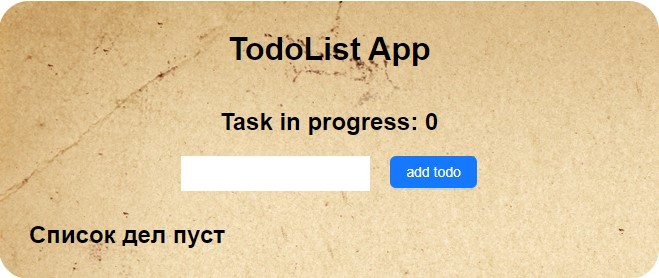
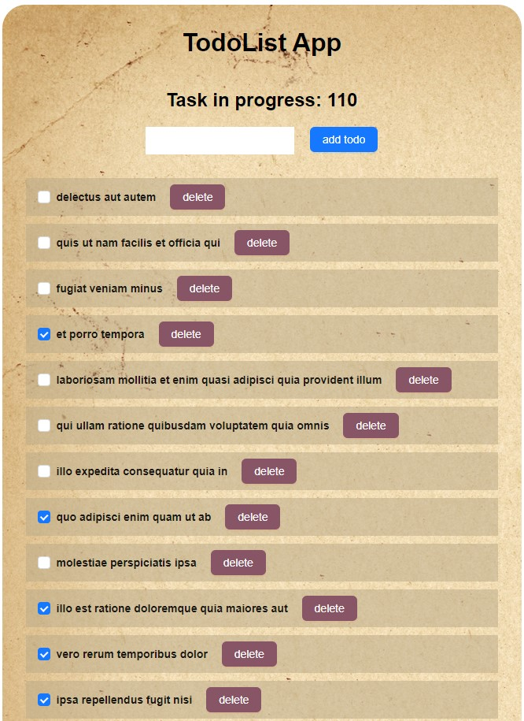
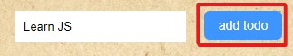
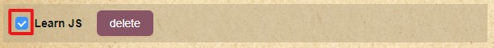
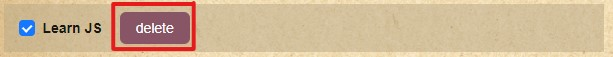

# TodoList App

#### Web-приложение для создания заметок своих дел. В приложении можно записывать свои задачи и помечать их как выполненные. Есть возможность удаления дела. В приложении присутствует счётчик невыполненных дел для отслеживания своего прогресса. Для отображения примеров задач используется API. После подгрузки данных с API, они выводятся на экран в виде списка задач.

## Общий вид приложения

### Общий вид приложения с введёнными задачами

## Функционал

- Ввод задачи (Добавление происходит после нажатия кнопки "add todo")
  
    

- Пометка задачи как выполненной (нажатие на checkbox)
  
    

- Удаление конкретной задачи (кнопка "delete" под каждой задачей)

    

## Стек технологий

- HTML
- CSS
- TypeScript
- React
- Ant Design
- Vite